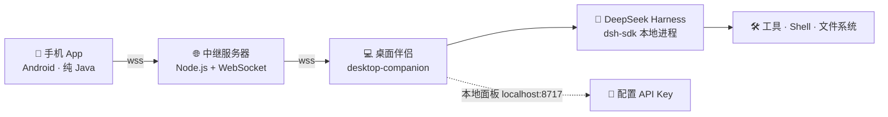

# Harness 助手（Harness Remote）

> 用手机遥控电脑上的 DeepSeek Harness 桌面 AI —— 端到端自部署，数据全程走你自己的服务器。

[](LICENSE)


## ✨ 功能亮点

- **📱 手机遥控电脑 AI**：对话、思考过程、工具调用实时同步到手机
- **🖥 远程终端**：手机上直接执行电脑命令（高危命令二次确认，不怕手滑）
- **🔀 模型切换**：DeepSeek Chat / Reasoner 一键切换（新会话生效）
- **🌿 会话分支**：从任意历史会话 fork 出新会话继续，多线任务互不干扰
- **📈 轨迹面板**：查看单条会话的完整事件时间线（思考 / 工具 / 消息 / 耗时）
- **🖼 图片 OCR**：手机选图 → 电脑本地识别 → 文本直接插入输入框（Windows 10+，离线免费）
- **🔐 端到端自部署**：数据不出你的服务器，账号体系（邀请码 + 邮箱验证 + 密码）自带

## 架构



三部分都要自部署：

| 组件 | 目录 | 技术栈 |
|------|------|--------|
| 中继服务器 | `server/` | Node.js + ws，轻量转发（device.online / chat.send / event） |
| 桌面伴侣 | `desktop-companion/` | Node.js + @deepseek-ai/dsh-sdk-client，驱动本机 Harness |
| 手机 App | `mobile-app/` | 纯 Android 原生 Java，无第三方依赖，直接 Build APK |

## 快速开始

### 1. 部署中继服务器（需一台公网服务器，建议 HTTPS/WSS）

```bash
cd server
npm install
# 在 server/ 目录创建 config.json（敏感配置不提交到仓库）：
# {
#   "auth_required": true,
#   "private_enabled": false,
#   "invite_codes": ["你的邀请码"],
#   "smtp": { "host": "smtp.qq.com", "port": 465, "user": "你的邮箱", "pass": "SMTP授权码", "mode": "smtp" },
#   "users_file": "users.json",
#   "code_ttl_sec": 300,
#   "code_cooldown_sec": 60
# }
npm run dev        # 开发（tsx）
# 生产：先用 tsc 编译，再 node dist/index.js（或用 pm2 守护）
```

对外暴露 8787 端口，建议用 Nginx/Caddy 反代成 `wss://你的域名/relay`（`/relay/app` 与 `/relay/device` 两条路径分别给 App 和桌面端）。

### 2. 电脑端：桌面伴侣

```bash
cd desktop-companion
npm install
setx RELAY_URL wss://你的服务器域名/relay/device   # Windows；Linux/Mac 用 export
node --run start                                     # 或双击 start-companion.bat
```

首次运行在手机 App 注册账号后，可打开本地面板 `http://localhost:8717` 用同一账号登录并填写 DeepSeek API Key（自动写入 `~/.dsh/.credentials.yaml`）。

> 电脑端需要先装好 DeepSeek Harness 本体（npm 依赖已包含其 SDK，按本包 package.json 安装即可），确保本机可运行 dsh agent。

### 3. 手机端：Build APK

```bash
cd mobile-app
gradle assembleRelease     # 或直接用 Android Studio 打开构建
```

安装后打开设置页，把「服务器地址」填成 `wss://你的服务器域名/relay/app`，保存后点顶部「连接」，用注册的账号登录即可。

## 目录结构

```
├── desktop-companion/   # 桌面伴侣（Node）
│   ├── src/             # tunnel(转发) / harness(驱动SDK) / jsonrpc-server(扩展op) / panel(本地面板)
│   │   └── scripts/ocr.ps1   # Windows WinRT OCR
│   ├── runtime/cordis.yml    # Harness runtime 插件配置
│   └── panel/index.html      # 本地面板页
├── mobile-app/          # Android App（纯 Java，零第三方依赖）
│   └── app/src/main/java/com/harness/assistant/
├── server/              # 中继服务器（Node + ws）
│   └── src/             # index(WS+HTTP) / auth / smtp / config
└── docs/                # 架构与协议说明（见下）
```

## 技术栈

| 层 | 技术 | 亮点 |
|----|------|------|
| 手机端 | Android 原生 Java | 零第三方依赖，离线可用，直接 Build APK |
| 中继层 | Node.js + `ws` | 轻量透明转发，一个服务器可挂多台电脑 |
| 电脑端 | `@deepseek-ai/dsh-sdk-client` | 直接驱动官方 Harness SDK，协议扩展即插即用 |
| 扩展协议 | JSON-RPC over WebSocket | `terminal.exec` / `session.fork` / `ocr.image` 等 6 个扩展 op |

## 协议扩展（v0.7.0）

桌面伴侣在 dsh JSON-RPC 协议上扩展了以下 op，App 与桌面端间经服务器透明转发：

| op | 说明 |
|----|------|
| `model.list` / `model.set` | 查询/切换模型 |
| `terminal.exec` | 远程终端（一次性执行 + 完整输出，高危命令拦截） |
| `session.fork` | 会话分支 |
| `session.trace` | 会话轨迹（事件时间线） |
| `ocr.image` | 图片 OCR（base64 → 本地识别） |

## 安全说明

- 服务器地址、SMTP 授权码、邀请码等敏感配置**不内置在代码中**，全部由部署者通过环境变量 / `config.json` 提供
- 手机 App 首次连接需手动填写服务器地址
- 远程终端对高危命令（rm -rf / del / 格式化等）默认拦截，需在手机上二次确认
- 生产环境务必使用 WSS + HTTPS，并修改所有默认密钥

## License

[MIT](LICENSE)

## Star ⭐ 支持

如果这个项目对你有帮助，欢迎点个 Star —— 你的支持是我持续更新的动力！

## 致谢

- [DeepSeek Harness](https://github.com/deepseek-ai/deepseek-harness) —— 桌面 AI 本体与 SDK
- 参考了 dshmk.com 生态中同类远程控制方案的设计
